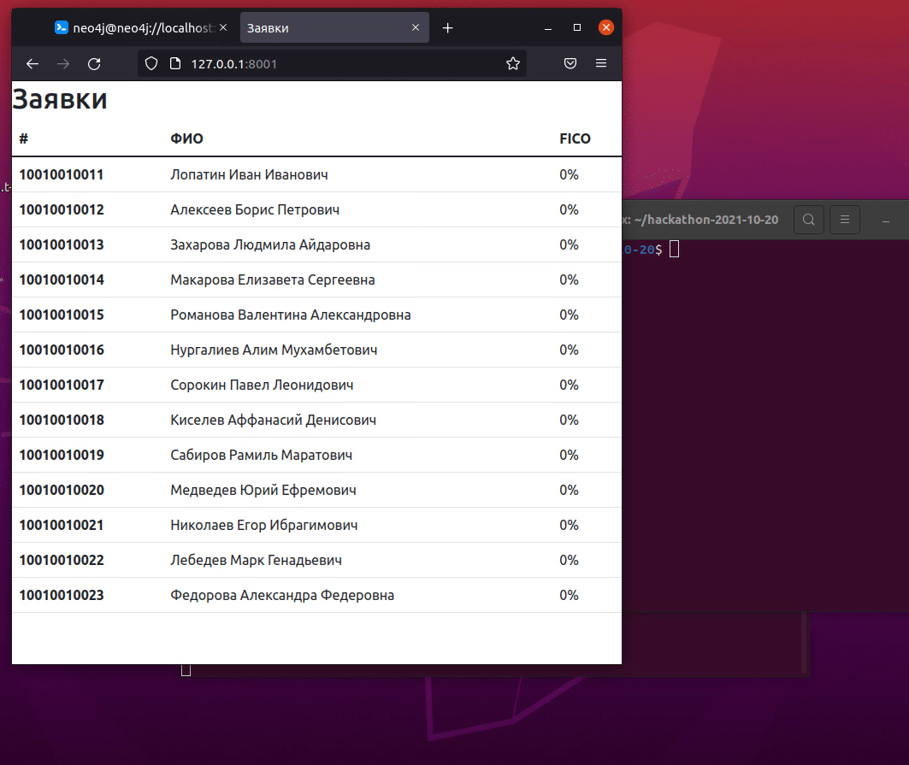

# Хакатон 2021-10-20 (Кейс 2)

## Модель принятия решения

Мы взяли за основу популярную модель FICO. Набранный процент по каждому клиенту помещается в колонку FICO таблицы FICO базы данных public в MySQL.



## Установка

```bash
sudo apt -y install git
cd $HOME
git clone https://github.com/zhdanov/hackathon-2021-10-20.git
cd hackathon-2021-10-20
./install.bash

php make-fico.php

php -S 0.0.0.0:8001 -t /home/gbc_user/hackathon-2021-10-20/

# открываем в браузере: http://127.0.0.1:8001/
```

## Таблица FICO (БД public)
```
+--------------------------+---------------+------+-----+---------+-------+
| Field                    | Type          | Null | Key | Default | Extra |
+--------------------------+---------------+------+-----+---------+-------+
| CLIENT_ID                | bigint        | YES  |     | NULL    |       |
| AMOUNT_REPAID_DEBTS      | decimal(12,4) | YES  |     | NULL    |       |
| AMOUNT_DEBT_NOW          | decimal(12,4) | YES  |     | NULL    |       |
| OVERDUE_AMOUNT_NOW       | decimal(12,4) | YES  |     | NULL    |       |
| AMOUNT_BALANCES          | decimal(12,4) | YES  |     | NULL    |       |
| LENGTH_CREDIT_HISTORY    | bigint        | YES  |     | NULL    |       |
| COUNT_DIFFERENT_ACCOUNTS | bigint        | YES  |     | NULL    |       |
| COUNT_NEW_CREDITS        | bigint        | YES  |     | NULL    |       |
| FICO                     | int           | YES  |     | NULL    |       |
+--------------------------+---------------+------+-----+---------+-------+
```

## Описание колонок таблицы FICO

```
+--------------------------+
| CLIENT_ID                | Идентификатор клиента
| AMOUNT_REPAID_DEBTS      | Сумма погашенных долгов
| AMOUNT_DEBT_NOW          | Сумма долга на текущий момент
| OVERDUE_AMOUNT_NOW       | Сумма просрочек на текущий момент
| AMOUNT_BALANCES          | Сумма остатка на счетах
| LENGTH_CREDIT_HISTORY    | Длина кредитной истории в днях
| COUNT_DIFFERENT_ACCOUNTS | Количество разных счетов (больше -- лучше)
| COUNT_NEW_CREDITS        | Количество новых кредитов (последний квартал)
| FICO                     | Набранный процент
+--------------------------+
```

## Вес колонок для расчета FICO 

```
35%  AMOUNT_REPAID_DEBTS
30%  AMOUNT_DEBT_NOW
15%  LENGTH_CREDIT_HISTORY
10%  COUNT_DIFFERENT_ACCOUNTS
10%  COUNT_NEW_CREDITS
```

## Таблица SNAPSHOT (БД public)

```
+------------+-----------+------+-----+---------+-------+
| Field      | Type      | Null | Key | Default | Extra |
+------------+-----------+------+-----+---------+-------+
| APP_ID     | bigint    | YES  |     | NULL    |       |
| CREATED    | timestamp | YES  |     | NULL    |       |
| PROD_APPS  | text      | YES  |     | NULL    |       |
| PROD_INS   | text      | YES  |     | NULL    |       |
| PROD_LOANS | text      | YES  |     | NULL    |       |
| FICO       | text      | YES  |     | NULL    |       |
+------------+-----------+------+-----+---------+-------+
```

## Описание колонок таблицы SNAPSHOT

```
+------------+
| APP_ID     | Идентификатор заявки
| CREATED    | Дата создания снапшота
| PROD_APPS  | Срез по клиенту из схемы prod_apps
| PROD_INS   | Срез по клиенту из базы prod_ins
| PROD_LOANS | Срез по клиенту из схемы prod_loans
| FICO       | Срез по клиенту из таблицы FICO
+------------+
```

## Описание модели FICO 

История платежей (35%)  
История платежей указывает на то, своевременно ли человек оплачивает свои кредитные счета.Кредитные отчеты показывают платежи, представленные по каждой кредитной линии, а отчеты о банкротстве или взыскании платежей вместе с любыми просроченными или пропущенными платежами.

Причитающиеся счета (30%)  
Причитающиеся счета относятся к сумме денег, которую должно физическое лицо.Наличие большого долга не обязательно означает низкий кредитный рейтинг .Скорее, FICO рассматривает отношение суммы задолженности к сумме доступного кредита.Чтобы проиллюстрировать, человек, который должен 10 000 долларов США, но у которого все его кредитные линии полностью расширены, а все его кредитные карты исчерпаны, может иметь более низкий кредитный рейтинг, чем человек, который должен 100 000 долларов США, но не приближается к пределу ни на одном из своих счетов.

Длина кредитной истории (15%)  
Как правило, чем дольше у человека есть кредит, тем лучше его балл.Однако с хорошими оценками в других категориях, даже человек с короткой кредитной историей может иметь хорошие оценки.Оценки FICO учитывают, как долго была открыта самая старая учетная запись, возраст самой новой учетной записи и общее среднее значение.

Кредитный микс (10%)  
Кредитный микс – это разнообразие счетов.Чтобы получить высокие кредитные рейтинги, физическим лицам необходимо сильное сочетание розничных счетов;кредитные карты;ссуды в рассрочку, такие как ссуды на подписку или ссуды на покупку транспортных средств;и ипотека.

Новый кредит (10%)  
Новый кредит относится к недавно открытым счетам.Если заемщик открыл несколько новых счетов за короткий период времени, это указывает на риск и снижает их оценку.
